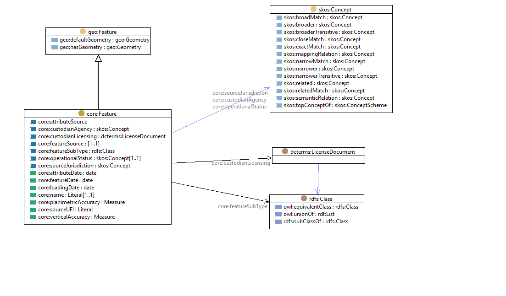

# FSDF core feature model

The [FSDF core feature model](rdf/core.ttl) defines the core properties attached to many FSDF themes (e.g. roads, pipelines, powerlines)

The FSDF core feature model has been adapted from the attribute & code-lists for the FSDF models:

- [FSDF roads schema](https://github.com/GeoscienceAustralia/FSDF-Roads/blob/master/Roads.xlsx)
- [FSDF pipelines schema](https://github.com/GeoscienceAustralia/FSDF-Pipelines/blob/master/Pipelines.xlsx)
- [FSDF powerlines schema](https://github.com/GeoscienceAustralia/FSDF-Powerlines/blob/master/Powerlines.xlsx)

The [FSDF core feature model](rdf/core.ttl) is summarized in this figure: 

