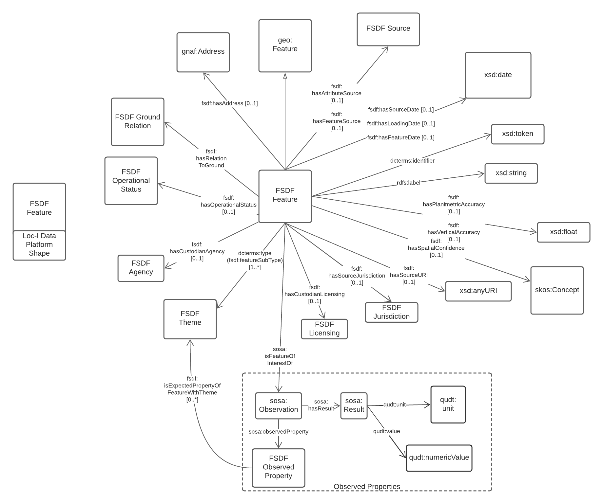

# FSDF model at feature level

FSDF model at feature level defines the properties attached to the FSDF features (e.g. facilities, powerlines, power stations)

The FSDF feature level model has been adapted from the attributes of the following datasets:

- [FSDF facilities](https://github.com/GeoscienceAustralia/FSDF-Facilities)
- [FSDF powerinfrastructure](https://github.com/GeoscienceAustralia/FSDF-PowerInfrastructure)

The model is summarized in this figure: 

