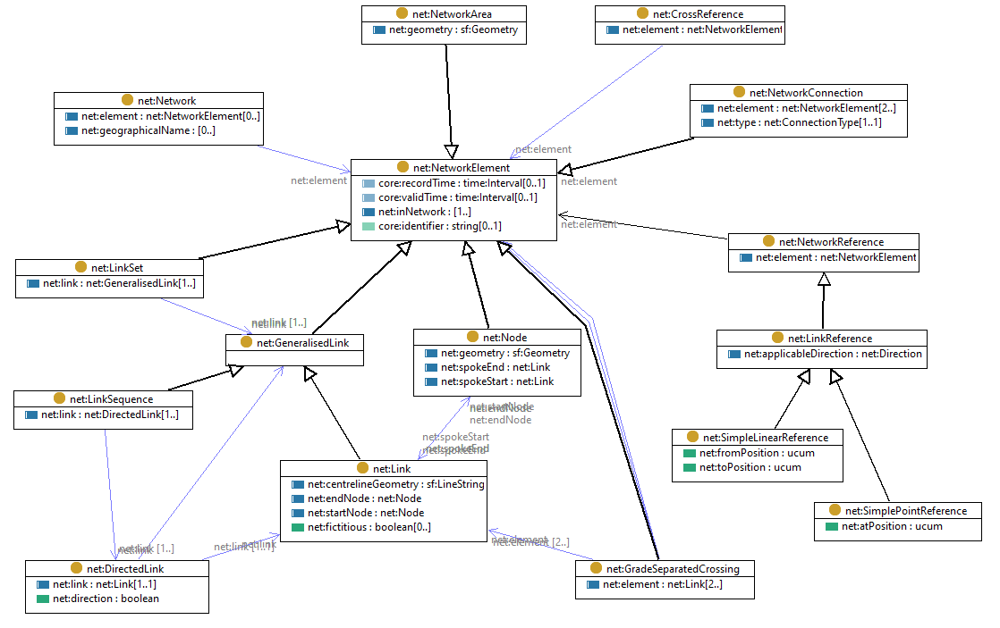

# Generic network model

The [FSDF network ontology](rdf/network.ttl) is a generic network model which may be used as the basis of the various network-oriented models (air-transport, hydrology, roads, ...)

The FSDF network ontology has been adapted from the INSPIRE Generic Network model

- [UML Model](https://inspire.ec.europa.eu/data-model/approved/r4618-ir/html/index.htm?goto=2:1:9:6:7586)

- [RDF implementation](https://github.com/inspire-eu-rdf/inspire-rdf-vocabularies/tree/master/net) (following ISO 19150-2 rules)

In the [FSDF network ontology](rdf/network.ttl) the following simplifcations are made

- simplify dependencies to only [FSDF base ontology](rdf/base.ttl), [GeoSPARQL](http://www.opengis.net/ont/geosparql), [SKOS](http://www.w3.org/2004/02/skos/core), [Dublin Core](http://purl.org/dc/terms/)
- simplify property-names by removing class-names, and merging predicates with the same semantics
- remove some global (domain) constraints on properties
- add local constraints to class definitions to match the UML model

The [FSDF network ontology](rdf/network.ttl) is summarized in this figure: 

