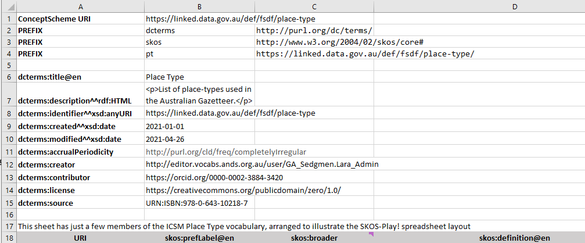
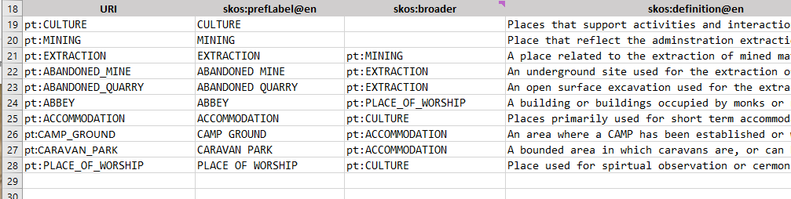
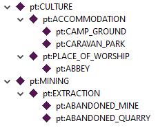
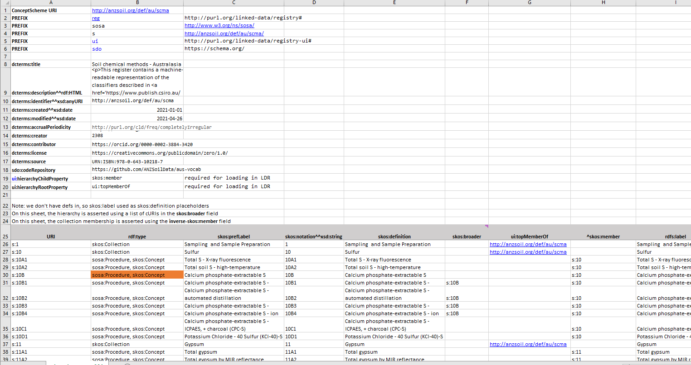
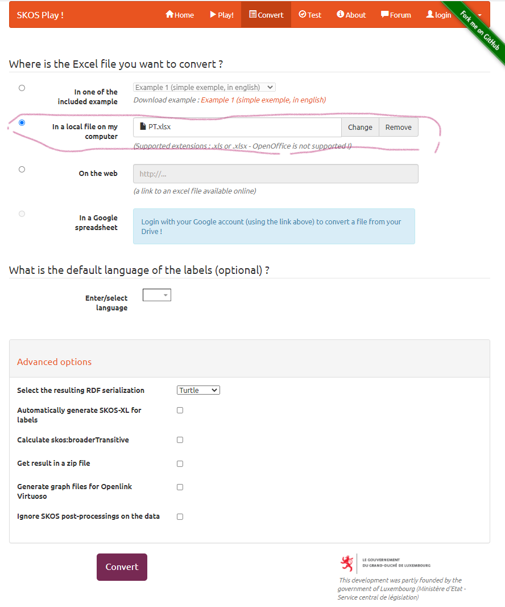

# Vocabulary Maintenance and Publication

## Point of truth

There are many options for the 'point of truth' for vocabulary content: databases, spreadsheets, online linked data, printed books. 
The semantic representation (using RDF/SKOS) is the most expressive, so maintaining these directly is optimal if possible. 
However, RDF files are too obscure and esoteric for most users. 
Subject matter experts are typically researchers or regulators or similar, for whom desktop tools like Excel are the most familiar mechanism for manipulating structured data. 
So in this note we focus on using an Excel file for formalizing and maintaining a vocabulary.  

## Excel template

There are a number of pathways from Excel to RDF/SKOS representations. 
Usually these require you to follow a specific layout of the sheet in order to allow for automatic conversion to RDF/SKOS. 
Different converters use different layouts. 

### SKOS-Play! 

For [SKOS-Play!](https://skos-play.sparna.fr/play/convert) the sheet starts with a header block containing vocabaulary metadata, some configuration information, then a row of labels designating the columns above the actual content. 
Setting up the headers requires some familiarity with RDF, so you may need to seek assistance with that step. 
But when it has been set up all the data (i.e. vocabulary terms and relationships) can be managed in the spreadsheet. 

#### Basic example - header

- **row 1** assigns a persistent URI to the ConceptScheme (i.e. the vocabulary as a whole) - `https://linked.data.gov.au/def/fsdf/place-type` 
- **rows 2-4** here associate full URIs to prefixes, which can then be used to abbreviate identifiers in the rest of the sheet 
    - there can be any number of prefixes defined
    - some of the namespaces denote pre-existing, external, standard RDF vocabularies - here `dcterms` and `skos`
    - at least one will be for the terms in this vocabulary - here `pt` is mapped to `https://linked.data.gov.au/def/fsdf/place-type/`
    - a namespace URI always ends with a `#` or `/`. The latter is generally preferred for large vocabularies
    - the actual prefix code (`dcterms`, `skos`, `pt`) is arbitrary, though there are conventions for well-known RDF vocabularies
- **rows 6-15** here provide metadata for the vocabulary as-a-whole
    - each row is a single item of metadata
    - the rows can be in any order
    - there can be any number of rows of metadata
    - in this example all the metadata terms are from the [Dublin Core metadata vocabulary](https://dublincore.org/specifications/dublin-core/dcmi-terms/) but terms from other vocabularies could be used
    - some of the metadata values are 'literals' - text or formatted strings - in which case the 'type' of the value _may_ be given as a suffix to the metadata tag (this is optional)
       - in **row 6** `@en` says the value is an English-language string
       - in **row 7** `^^rdf:HTML` says the value is a fragment of HTML
       - in **row 8** `^^xsd:anyURI` says the value is a string formatted as a valid URI (this is different to a link)
       - in **rows 8,9** `^^xsd:date` says the value is an ISO-formatted date
    - some of the metadata values are links to web resources, where the cross-reference is given as a URI
       - there is no suffix on the metadata tag in **rows 11-15** where the value is a URI
       - the example value in **row 15** is a `URN` - this is still a URI though it is not dereferenceable
- **rows 5** and **16** are blank. **row 17** has a comment which will not appear in the output. Any number of these are allowed in the header
- **row 18** (here) defines the structure for the rows of data below. 
    - **column A** must be `URI` 
    - **columns B-D** hold the SKOS tags for a minimal structured vocabulary - `skos:prefLabel`, `skos:definition`, `skos:broader`; these can be given in any order
    - the row is shaded and bold for useability, but this is not required

#### Basic example - Data 

- **rows 19-onwards** contain the term definitions, one per row
    - **column A** is the web-identifier for the term  
        - in the example each is an abbreviated URI, here using the prefix `pt` which was defined in **row 4** 
        - _Note: the full URI can be used if preferred; it is the concatenation of the namespace and the local-name, so `pt:CULTURE` expands to `https://linked.data.gov.au/def/fsdf/place-type/CULTURE`_
    - **column B** is the `preferred label` or term 
    - **column C** is a pointer to a `broader` term using its URI - leave blank if the term is the top of the hierarchy
    - **column D** is a textual `definition` for the term 

The data shown corresponds to the following hierarchy:

 

#### Advanced example

The key extras in the advanced examples are 
1. more external namespaces bound to prefixes, including `sosa` which is a domain-specific vocabulary
2. elements from multiple namespaces are used in the data structure row - `rdf:type`, `ui:topMemberOf`, `rdfs:label` etc.
3. not every row is a `skos:Concept`, so an `rdf:type` column is used to assign explicit class(es) for each term - some are `skos:Concept`, some `skos:Collection`, some `sosa:Procedure`, some more than one (comma-separated)
    - in fact SKOS-Play! can be used to manage any RDF data, and does not need to involve SKOS
4. use of 'inverse' property references - here `^skos:member`. This allows collection-member relations to be captured one at a time, which is much easier to manage than a comma-separated list in the primary direction, which could have dozens or hundreds of items in the context of some vocabularies

For the full details of the SKOS-Play! layout see [https://skos-play.sparna.fr/play/convert#excel-file-structure](https://skos-play.sparna.fr/play/convert#excel-file-structure)

Note that the structure of the vocabulary in this example is much more complex than the simple one discussed above, so requires more analysis and RDF knowledge to set up. 

## Generating RDF (SKOS) 

Go to https://skos-play.sparna.fr/play/convert 
- Check **In a local file on my computer** and select the xslx file. 
- Select **Convert**
- Save the result into a file `{name}.ttl`

## Publishing the vocabulary in RVA

- Login to [Research Vocabularies Australia](https://vocabs.ardc.edu.au/vocabs/login) 
- go to `My Vocabs`
- Follow the instructions for [Publishing a non-PoolParty vocabulary to the RVA portal](https://documentation.ardc.edu.au/display/DOC/Publishing+a+non-PoolParty+vocabulary+to+the+RVA+portal)

