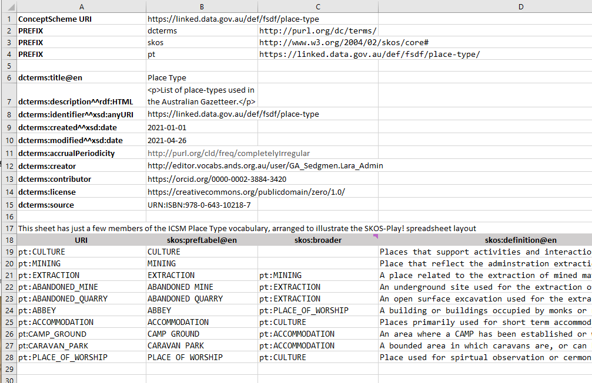

# Vocabulary Maintenance 

## Point of truth

There are many options for the 'point of truth' for vocabulary content: databases, spreadsheets, online linked data, printed books. 
The semantic representation (using RDF/SKOS) is the most expressive, so maintaining these directly is optimal if possible. 
However, RDF files are generally too obscure and esoteric for most users. 
Subject matter experts are typically researchers or regulators or similar, for whom desktop tools like Excel are the most familiar mechanism for manipulating structured data. 
So in this note we focus on using an Excel file for formalizing and maintaining a vocabulary.  

## Excel template

There are a number of pathways from Excel to RDF/SKOS representations. 
Typically these require you to follow a specific layout of the sheet in order to allow for automatic conversion to RDF/SKOS. 
Different converters use different layouts. 

### SKOS-Play! 

In [SKOS-Play!](https://skos-play.sparna.fr/play/convert) the sheet starts with a header block containing vocabaulary metadata, some configuration information, then a row of labels designating the columns above the actual content. 
Setting up the headers requires some familiarity with RDF, so you may need to seek some assistance with that step. 
But when it has been set up all the data (i.e. vocabulary terms and relationships) can be managed in the spreadsheet. 

#### Basic example

This is structured as follows: 

- **row 1** assigns a persistent URI to the ConceptScheme (i.e. the vocabulary as a whole) - `https://linked.data.gov.au/def/fsdf/place-type` 
- **rows 2-4** here associate full URIs to prefixes, which can then be used to abbreviate identifiers in the rest of the sheet 
    - there can be any number of prefixes defined
    - some of the namespaces denote pre-existing, external, standard RDF vocabularies - here `dcterms` and `skos`
    - at least one will be for the terms in this vocabulary - here `pt` is mapped to `https://linked.data.gov.au/def/fsdf/place-type/`
    - a namespace URI always ends with a `#` or `/`. The latter is generally preferred for large vocabularies
    - the actual prefix code (`dcterms`, `skos`, `pt`) is arbitrary, though there are conventions for well-known RDF vocabularies
- **rows 6-15** here provide metadata for the vocabulary as-a-whole
    - each row is a single item of metadata
    - the rows can be in any order
    - there can be any number of rows of metadata
    - in this example all the metadata terms are from the [Dublin Core metadata vocabulary](https://dublincore.org/specifications/dublin-core/dcmi-terms/) but terms from other vocabularies could be used
    - some of the metadata values are 'literals' - text or formatted strings - in which case the 'type' of the value _may_ be given as a suffix to the metadata tag 
       - in **row 6** `@en` says the value is an English-language string
       - in **row 7** `^^rdf:HTML` says the value is a fragment of HTML
       - in **row 8** `^^xsd:anyURI` says the value is a string formatted as a valid URI (this is different to a link)
       - in **rows 8,9** `^^xsd:date` says the value is an ISO-formatted date
    - some of the metadata values are links to web resources, given as URIs
       - there is no suffix on the metadata tag in **rows 11-15** where the value is a URI
       - the value in **row 15** is a `URN` which is a non-dereferenceable URI
- **rows 5** and **16** are blank. **row 17** has a comment which will not appear in the output. Any number of these are allowed in the header
- **row 18** (here) defines the structure for the rows of data below. 
    - `URI` is always in **column A**
    - **columns B-D** hold the SKOS tags for a minimal structured vocabulary - `skos:prefLabel`, `skos:definition`, `skos:broader`; these can be given in any order
    - it does not have to be shaded or bold
- **rows 19-onwards** contain the term definitions, one per row
    - **column A** is the web-identifier for the term  
        - in the example these are abbreviated URIs, using the prefix `pt` defined in **row 4** 
        - the full URI is the concatenation of the namespace and the local-name
            - for example `pt:CULTURE` expands to `https://linked.data.gov.au/def/fsdf/place-type/CULTURE`
    - **column B** is the `preferred label` or term 
    - **column C** is a pointer to a `broader` term - left blank if the term is the top of the hierarchy
    - **column D** is a textual `definition` for the term 

#### Advanced example

The key additions in this examples are 
1. more external namespaces bound to prefixes, including the domain-specific `sosa`
2. elements from multiple namespaces in the data structure row - `rdf:type`, `ui:topMemberOf`, `rdfs:label` etc.
3. not all rows are `skos:Concept`, so the `rdf:type` column has explicit class(es) for each term - some are `skos:Concept`, some `skos:Collection`, some `sosa:Procedure`
    - in fact SKOS-Play! can be used to manage any RDF data, and does not need to involve SKOS
4. use of 'inverse' property references - here `^skos:member`. This allows collection-member relations to be captured one at a time, which is much easier to manage than a comma-separated list in the primary direction, which could have dozens or hundreds of items in some vocabularies

The structure of this vocabulary is much more complex than the simple one above, so requires more analysis and RDF knowledge to set up. 

## Generating RDF (SKOS) 

Go to https://skos-play.sparna.fr/play/convert 
Check **In a local file on my computer** and select the xslx file. 

**Convert**

Copy result into `xxx.ttl` file. 

## Loading in RVA

Login to https://vocabs.ardc.edu.au and go to 'My Vocabs'. 

+ Add a new Vocabulary

Select owner

Enter metadata. 

Add a version - give the version a name like 'FedUni Version' 

Add Access Point
- TTL
- Select scma.ttl
- Add
- Display Collections (**not ConceptScheme**)
- Import, make available
Add this version

Publish

